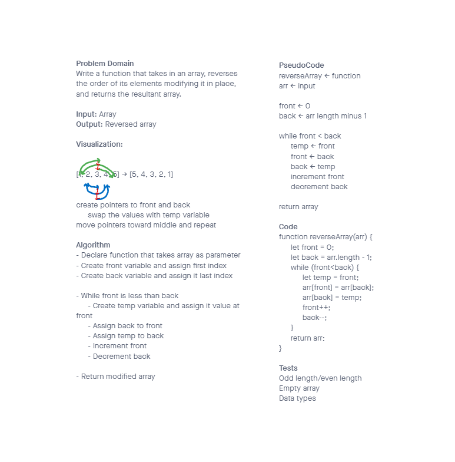

# Reverse an Array

Write a function called reverseArray which takes an array as an argument. Without utilizing any of the built-in methods available to your language, return an array with elements in reversed order.

## Whiteboard Process

## Approach & Efficiency

The array was modified in place by switching pairs of elements. This approach minimizes memory overhead, only requiring space for one variable that gets reused each loop.

- Time = O(length)

- Space = O(1)
