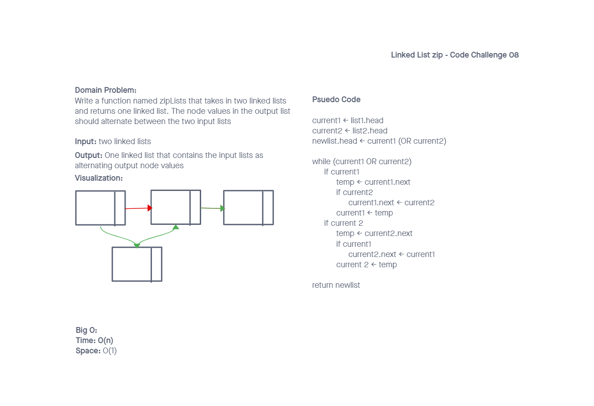

# Singly Linked List

## Challenge

### Node

Create a Node class that has properties for the value stored in the Node, and a pointer to the next Node.

### Linked List

- Create a Linked List class
- Within your Linked List class, include a head property.
  - Upon instantiation, an empty Linked List should be created.
- The class should contain the following methods
  - insert
    - Arguments: value
    - Returns: nothing
    - Adds a new node with that value to the head of the list with an O(1) Time performance.
  - includes
    - Arguments: value
    - Returns: Boolean
    - Indicates whether that value exists as a Node’s value somewhere within the list.
  - toString
    - Arguments: none
    - Returns: a string representing all the values in the Linked List, formatted as:
    - "{ a } -> { b } -> { c } -> NULL"
  - append
    - arguments: new value
    - adds a new node with the given value to the end of the list
  - insert before
    - arguments: value, new value
    - adds a new node with the given new value immediately before the first node that has the value specified
  - insert after
    - arguments: value, new value
    - adds a new node with the given new value immediately after the first node that has the value specified
  - kthFromEnd
    - arguments: number
    - finds the value of the node a certain number of nodes from the end

  - Stretch Goal: Write an additional method to delete a node with the given value from the linked list
  - Stretch Goal: Implement a method that finds the node at the middle of the Linked List.
- Stretch Goal: Implement a doubly linked list
- Write a function called zip lists
  - Arguments: 2 linked lists
  - Return: New Linked List, zipped as noted below
  - Zip the two linked lists together into one so that the nodes alternate between the two lists and return a reference to the the zipped list.
- Stretch Goal: Implement a function that merges two sorted linked lists into a single sorted linked list.

## Approach & Efficiency

- insert
  - time = O(1)
  - space = O(n)
- includes
  - time = O(n)
  - space = O(1)
- toString
  - time = O(n)
  - space = O(n)
- append
  - time = O(n)
  - space = O(n)
- insertBefore
  - time = O(n)
  - space = O(n)
- insertAfter
  - time = O(n)
  - space = O(n)
- delete
  - time = O(n)
  - space = O(1)
- kthFromEnd
  - time = O(n)
  - space = O(1)
- middleNode
  - time = O(n)
  - space = O(1)
- zipLists
  - time = O(n)
  - space = O(1)
- zipSort
  - time = O(n)
  - space = O(1)

## Whiteboards

