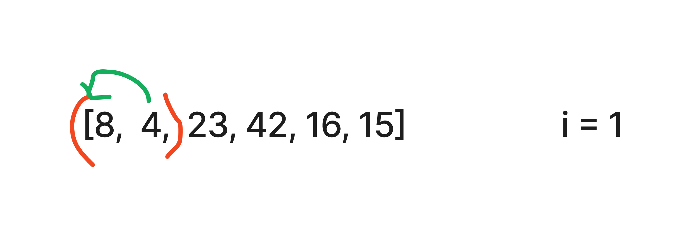
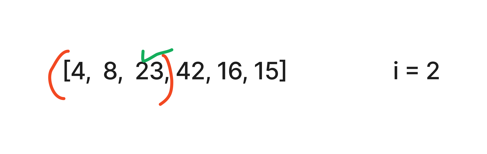
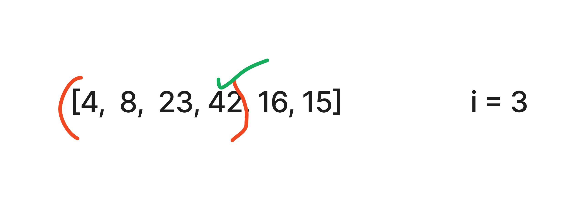
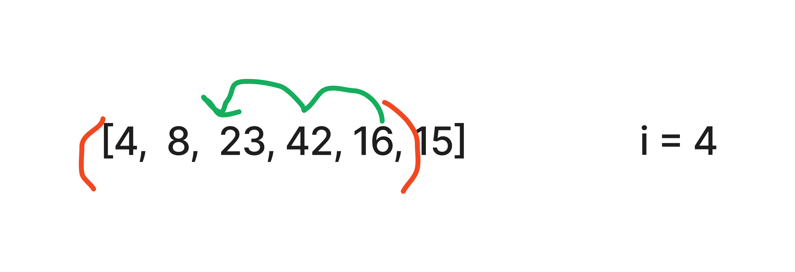
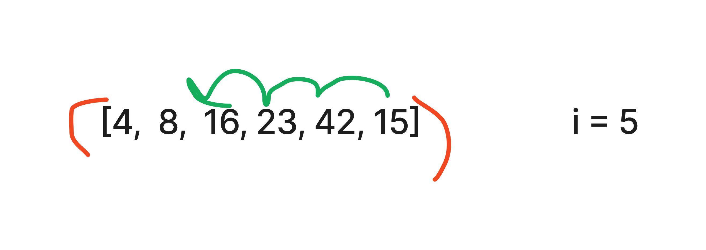
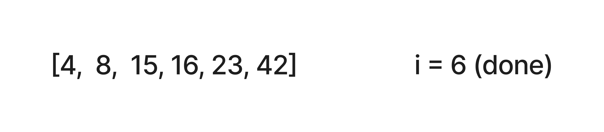

# Insertion Sort

Insertion sort is an algorithm that traverses an array multiple times, each time adding the "new" value to the appropriate place in the sub-array.

## Psuedocode

``` psuedocode
  InsertionSort(int[] arr)

    FOR i = 1 to arr.length

      int j <-- i - 1
      int temp <-- arr[i]

      WHILE j >= 0 AND temp < arr[j]
        arr[j + 1] <-- arr[j]
        j <-- j - 1

      arr[j + 1] <-- temp
```

## Sample Step-Through

To begin, the value at index 1 stored in the `temp` variable, then `temp` is compared to index 0. Since it is less, the value at 0 is stored in the array at index 1. There are no more values to compare, so `temp` (the value 4) is assigned to index 0.



Now the process starts at index 2. The value 23 is stored in `temp` and compared to 8. It is not less, so `temp` is assigned to index 2 and i increments.



Now the process starts at index 3. The value 42 is stored in `temp` and compared to 23. It is not less, so `temp` is assigned to index 3 and i increments.



Now the process starts at index 4. The value 16 is stored in `temp` and compared to 42. It is less than 42, so 42 is assigned to index 4 and `temp` is compared to 23. It is less than 23, so 23 is assigned to index 3 and `temp` is compared to 8. It is not less, so `temp` is assigned to index 2 and i increments.



Now the process starts at index 5. The value 15 is stored in `temp` and compared to 42. It is less than 42, so 42 is assigned to index 5 and `temp` is compared to 23. It is less than 23, so 23 is assigned to index 4 and `temp` is compared to 16. It is less than 16, so 16 is assigned to index 3 and `temp` is compared to 8. It is not less, so `temp` is assigned to index 2 and i increments.



`i` is now equal to the length of the array, so the loop is over and the array is sorted.



## Efficiency:

Time: O(n^2)

- Since there are nested loops that each depend on the length of the array, this algorithm will have a minimum of quadratic time efficiency. If the array is already sorted, only one comparison will be made on each outer loop, so the algorithm has a maximum time efficiency of O(n)

Space: O(1)

- The only space being used are thheh variables for incrementing and the temp variable, so it has constant space requirements.
