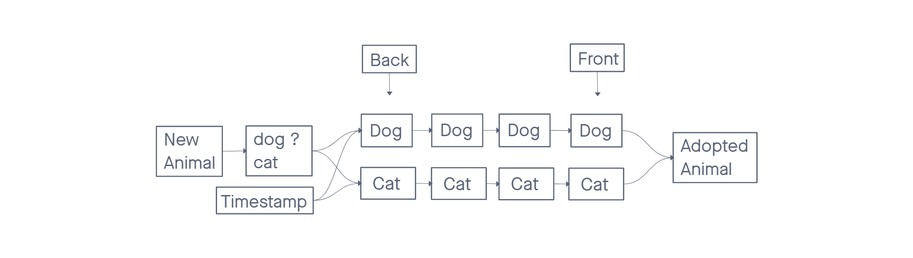

# Stacks and Queues

## Challenge

First-in, First out Animal Shelter.

### Animal Shelter

Create a Node class that has properties for the value stored in the Node, and a pointer to the next node.

Create a class called AnimalShelter which holds only dogs and cats. The shelter operates using a first-in, first-out approach. Implement the following methods:

- enqueue
  - Arguments: animal
  - animal can be either a dog or a cat object.
- dequeue
  - Arguments: pref
    - pref can be either "dog" or "cat"
  - Return: either a dog or a cat, based on preference.
    - If pref is not "dog" or "cat" then return null.
- Stretch Goal
  - If a cat or dog isn’t preferred, return whichever animal has been waiting in the shelter the longest.

## Approach & Efficiency

We used two queues to separate the two animal types. This gives us better efficiency when dequeueing a requested animal type as it removes the need to traverse the queue to find the requested type. Assuming that the size of the animal object is not arbitrarily large, both time and space performance are O(1) for both the enqueue and dequeue functions.

### Visualization

