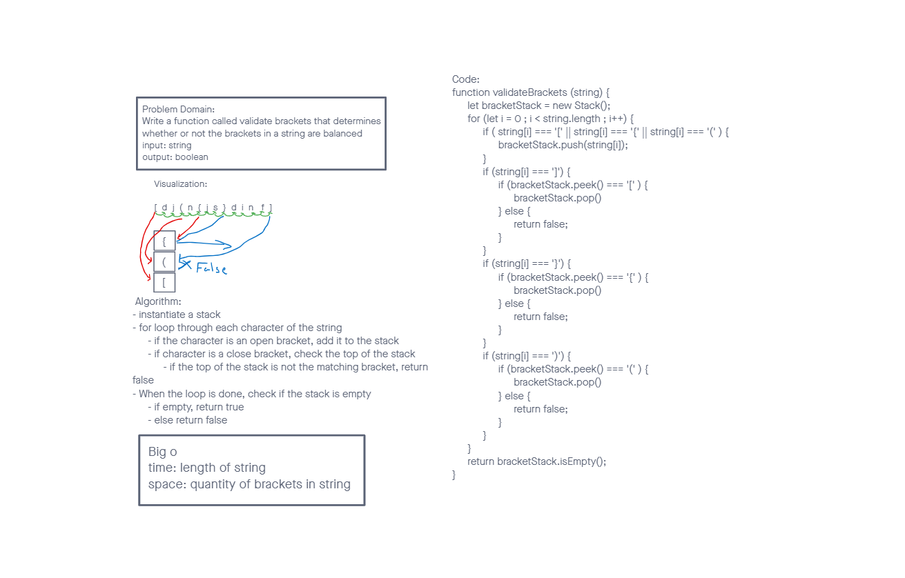

# Stacks and Queues

## Challenge

Write a function called validate brackets that determines whether or not the brackets in a string are balanced

### Animal Shelter

Write a function called validate brackets

- Arguments: string
- Return: boolean (representing whether or not the brackets in the string are balanced)

There are 3 types of brackets:

- Round Brackets : `()`
- Square Brackets : `[]`
- Curly Brackets : `{}`

## Approach & Efficiency

We used a stack to keep track of what the last unmatched bracket was while we iterate through the string.

Time = O(n) where n is the length of the string

space = O(n) where n is the maximum number of unmatched brackets

### Visualization

## Solution

`npm test stack-and-queue` will run the tests for this challenge and several related stack and queue challenges.
