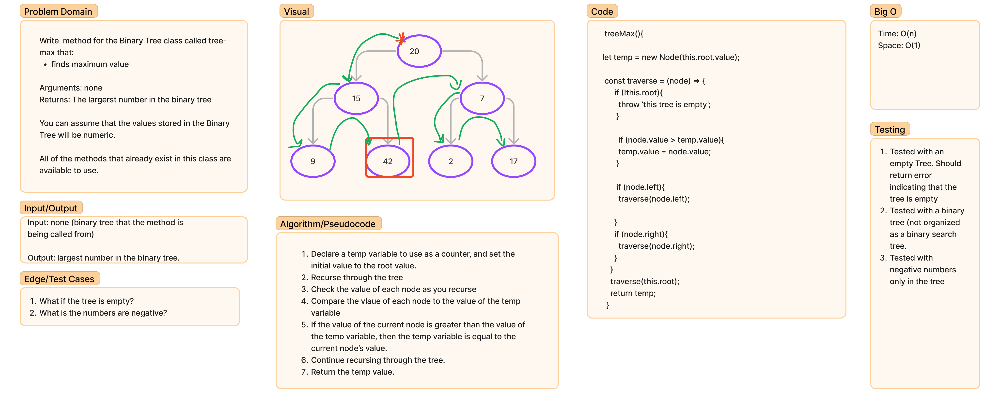
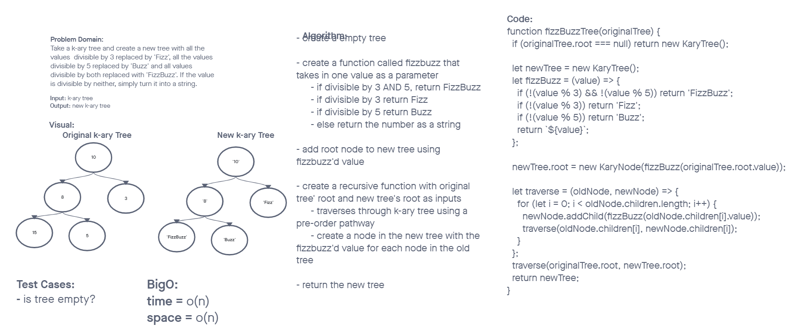

# Trees

## Challenge

### Node

Create a Node class that has properties for the value stored in the node, the left child node, and the right child node.

### Binary Tree

Create a Binary Tree class

- Define a method for each of the depth first traversals which returns an array of the values, ordered appropriately:
  - pre order
  - in order
  - post order
- find maximum value
  - Arguments: none
  - Returns: number

### Binary Search Tree

Create a Binary Search Tree class. This class should be a sub-class (or your languages equivalent) of the Binary Tree Class, with the following additional methods:

- Add
  - Arguments: value
  - Return: nothing
  - Adds a new node with that value in the correct location in the binary search tree.
- Contains
  - Argument: value
  - Returns: boolean indicating whether or not the value is in the tree at least once.

### Fizz Buzz Tree

Conduct “FizzBuzz” on a k-ary tree while traversing through it to create a new tree. Set the values of each of the new nodes depending on the corresponding node value in the source tree.

- Arguments: k-ary tree
- Return: new k-ary tree
  - If the value is divisible by 3, replace the value with “Fizz”
  - If the value is divisible by 5, replace the value with “Buzz”
  - If the value is divisible by 3 and 5, replace the value with “FizzBuzz”
  - If the value is not divisible by 3 or 5, simply turn the number into a String.

## Approach & Efficiency

All of the Binary Tree traversal methods have a time complexity of O(n) where n is the number of nodes in the tree.

The SearchTree's add and contain functions both have a time complexity of O(h), where h is the height of the tree; in a balanced tree, this is equivalent to O(log n) for n nodes.

Find maximum value has a time complexity of O(n), as it traverses the entire tree. It has constant O(1) space requirements.

Fizz Buzz Tree has a time complexity of O(n), as it traverses the entire tree. It also has a space complexity of O(n) as it is creating a new tree of the same size as the original tree.

